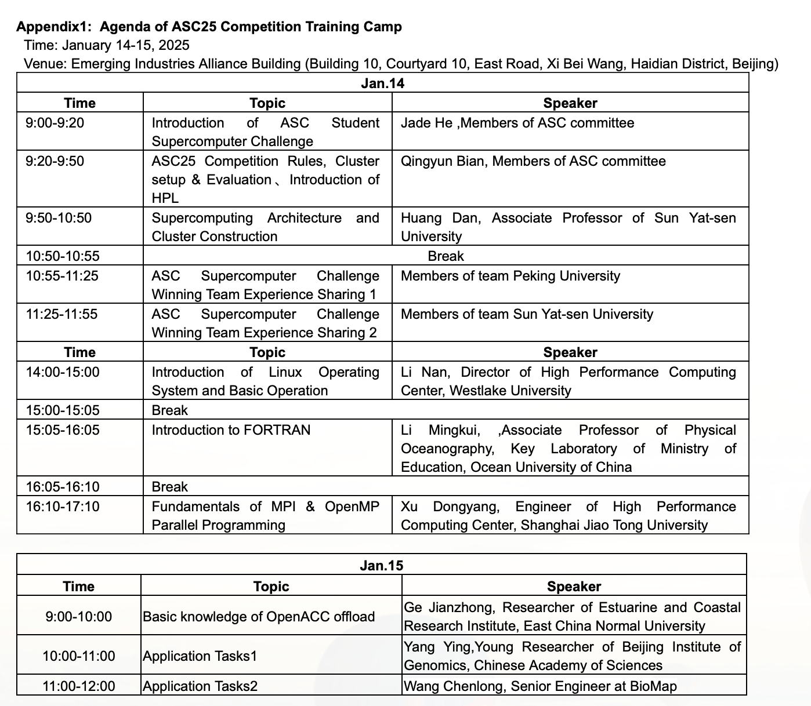
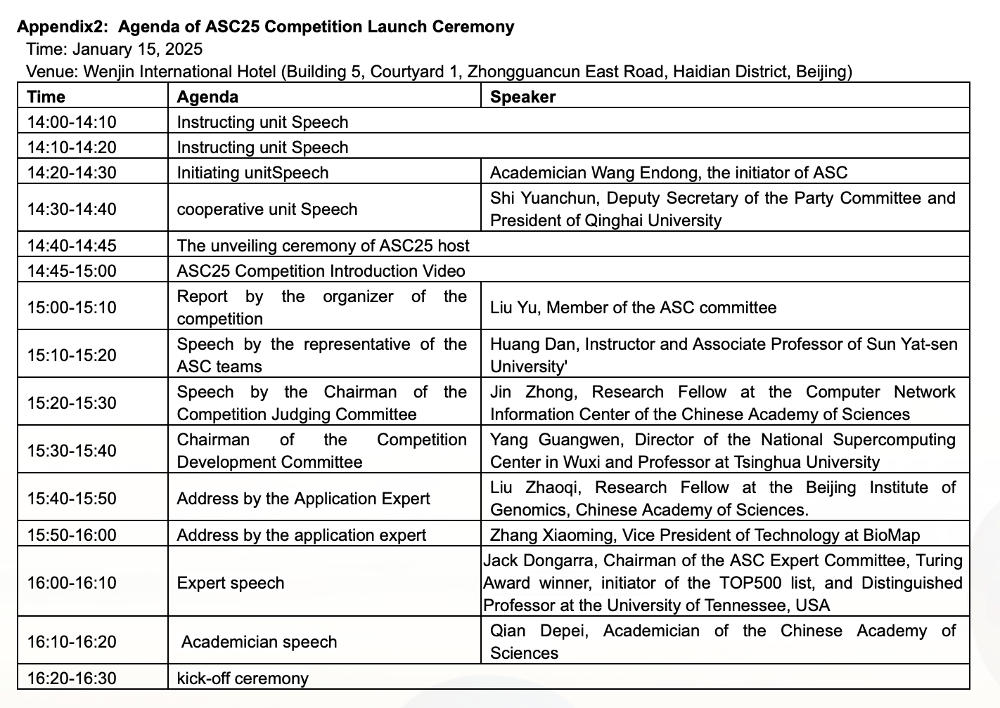

1.6 problem announced

1.12 @zy commit一下workflow_summary.md中的TODO
1.12 周日下午装机器
1.13 @scy @zy @zcp 争取把全流程跑起来，整理一下问题。
1.14-1.15 Training Camp

其中 1.15 11:00-12:00 是本题的介绍环节（也就是我们的提问时间）

1.29 春节
2.21 24:00 ddl